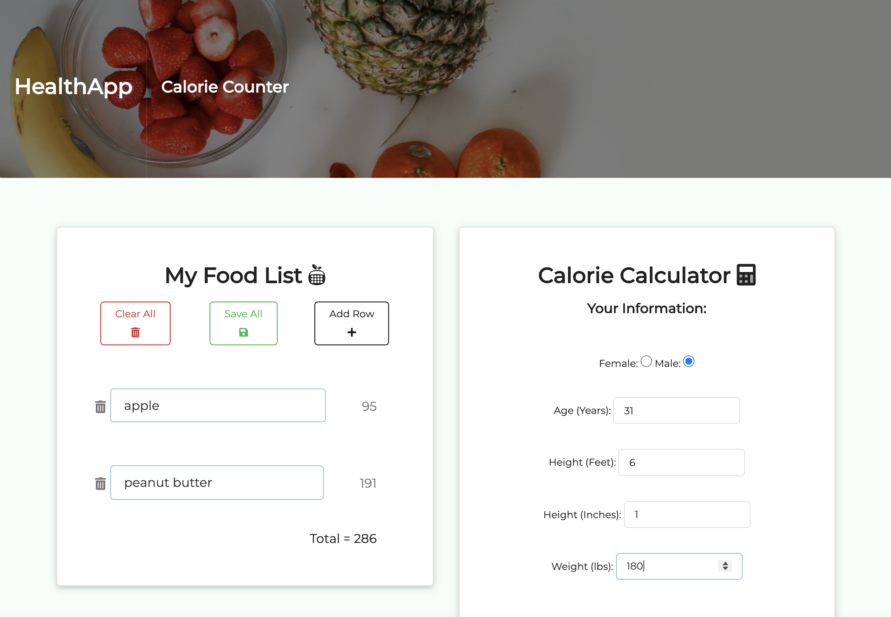

# HealthApp

### Deployed Application 

[HealthApp](https://mhans003.github.io/healthapp/index.html)

### Description 

This application allows a user to search for local health-oriented business based on individual needs and goals. 

The user is prompted to select several categories that pertain to their health interests in the areas of fitness, nutrition, and wellness. The application uses this input to create a request to the Yelp API, which returns the most relevant local businesses based on the selected options. In addition, the user may utilize the application's calorie counter, which allows the user to track daily calorie intake. Finally, the user can compare their calorie intake to their recommended daily caloric needs based on physical attributes. 

The program ensures that when the Yelp API does not respond as desired to a request, the Zomato API intervenes and retrieves a set of limited results. The Nutritionix API retrieves specific calorie information about food inputs. The page automatically locates the user's current location and searches the local area for relevant businesses. 

### User Story

AS AN Aspiring Health Enthusiast 

I WANT to find local health oriented businesses

SO THAT I reach my personal health goals

### Features

* Responsive to screen sizes across devices. 
* Incorporates Semantic UI utilities including multiple dropdowns, containers, and inputs.
* Makes calls to 3 APIs, including Yelp, Zomato, and Nutritionix.
* Stores the user's food input in the browser's local storage. 

### License 

Licensed under the [MIT License](./LICENSE.txt).
